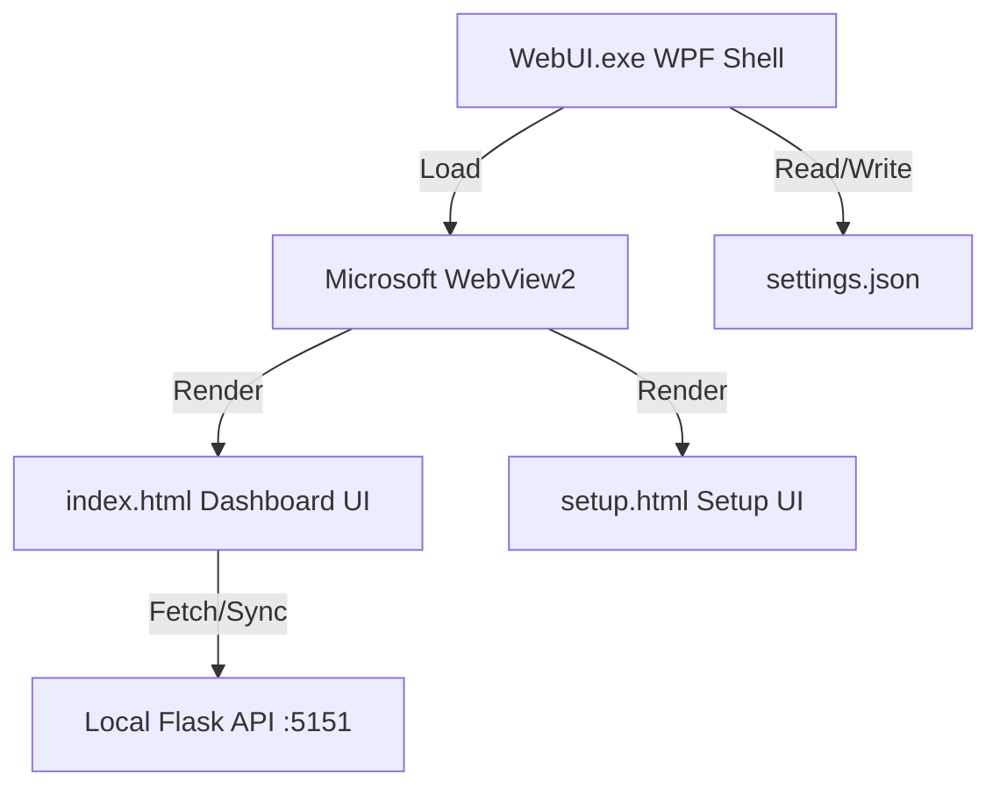

# WebUI Loader & Meeting Intent Detection Dashboard

> **翻訳:** [English (英語)](README.md)

WPF（Windows Presentation Foundation）および Microsoft WebView2 を使用して構築された、デスクトップ埋め込み型／ウィジェット型のカスタムブラウザローダーおよび会議インテント検出ダッシュボードです。

> [!NOTE]
> 本プロジェクトは、横長（1420x240）の境界線なし（Borderless）ウィンドウとして動作し、デスクトップのオーバーレイやダッシュボードウィジェットとして配置・使用されることを想定しています。

---

## 🚀 主な機能

### 1. WPF ホストアプリケーション (`WebUI.exe`)
*   **フレームレス＆ボーダーレスデザイン**: タイトルバーや境界線がない、極限までシンプルに削ぎ落とされた横長フラットデザイン（1420x240 px）。
*   **カスタムドラッグバー**: ウィンドウ左端にある縦型のグレーのドラッグバーを使用して、デスクトップ上の好きな場所に自由に配置可能。
*   **動的な初回起動設定**: 初回起動時に設定ファイル（`settings.json`）が見当たらない場合、対話式のセットアップ画面（`setup.html`）を自動で読み込み、指定されたダッシュボードURLを構成して `settings.json` に保存します。
*   **リセットサポート**: `settings.json` を削除すると、次回の起動時に再びセットアップ画面が表示されます。
*   **ダブルクリックによる最大化（フルスクリーン）**: ウィンドウ本体や左端のドラッグバーをダブルクリックすることで、最大化（フレームレスのため自動的にフルスクリーン）と通常サイズ（1420x240 px）をトグル切り替え可能。
*   **接続失敗時の自動リセット**: 設定されたウェブページがアクセス不可（サーバーダウンなど）の状態でアプリが終了した場合、自動的に `settings.json` を削除し、次回起動時にセットアップ画面（`setup.html`）を再表示。
*   **ローカルファイルフォールバック**: 指定したファイルが見つからない場合は、自動的に同梱の `index.html` にフォールバックして表示。
*   **クリーンシャットダウン**: アプリ終了時に WebView2 の一時ユーザーデータフォルダ（キャッシュ）を自動的に検知・削除し、ディスクをクリーンに維持。

### 2. ミーティングインテント検出ダッシュボード (`index.html`)
*   **リアルタイム・インテントログ**: 会議中の発言や検出されたイベント（Action Item, Concern/Q, Agreement, Topic Change 等）を時系列で表示。
*   **役職（ロール）フィルタリング**: `Manager` / `Developer` / `Sales` または任意のカスタムロールを入力して、自身に関係するインテントのみをフィルタリング可能。
*   **可視化グラフ (Chart.js)**: 検出されたインテントの比率をドーナツチャートでグラフィカルに自動集計・表示。
*   **AI ミーティングサマリー**: 会議のアジェンダや課題（Issue）、対策（Countermeasure）をレトロなサイバーパンク/ターミナル風UIのモーダルウィンドウで表示。
*   **API 連携 / シミュレーション**: 
    *   ローカルの Flask API 等（`http://127.0.0.1:5151`）とリアルタイムで通信し、会議セッションの管理、設定値の同期、リアルタイムログの取得、サマリーデータのダウンロードに対応。
    *   API が動いていない場合のフォールバックおよびモックシミュレーションデータを搭載。

---

## 🛠️ システム構成と依存関係



*   **フロントエンド**: HTML5, Vanilla JavaScript, Tailwind CSS (CDN), Chart.js (CDN)
*   **バックエンド (シェル)**: C# / WPF (.NET Framework 4.7.2)
*   **ブラウザエンジン**: Microsoft.Web.WebView2 (NuGet パッケージ)
*   **連携対象API**: `http://127.0.0.1:5151` (会議中インテントを配信する Flask API 等)

---

## 📦 ビルドとパッケージング

本プロジェクトには、自動ビルドと配布用パッケージングをワンクリックで行うバッチファイルが用意されています。

### ビルド手順

1.  プロジェクトのルートフォルダにある [build.bat](file:///d:/dev/InnoFes/WebUI-Loader/build.bat) をダブルクリック、またはコマンドプロンプトで実行します。
    ```cmd
    build.bat
    ```
2.  スクリプトが自動的に以下を実行します：
    *   Visual Studio Installer から `MSBuild.exe` を自動探索
    *   ビルドに必要な `nuget.exe` を一時フォルダにダウンロードし、依存パッケージ（WebView2）を復元
    *   Release 構成でのプロジェクトの再ビルド (`/t:Rebuild`)
    *   配布に必要なファイルだけを [dist/](file:///d:/dev/InnoFes/WebUI-Loader/dist) フォルダに集約・パッケージング

### 配布パッケージ (`dist/` の構成)
ビルド完了後、`dist/` フォルダ内には動作に必要な以下のファイルが含まれます。このフォルダをそのまま配布して実行できます。

*   `WebUI.exe`（アプリケーション本体）
*   `WebUI.exe.config`（標準構成ファイル）
*   `index.html`（デフォルトのダッシュボード画面）
*   `setup.html`（初期設定画面）
*   `Microsoft.Web.WebView2.*.dll`（WebView2ランタイムライブラリ）
*   `runtimes/`（CPUアーキテクチャごとのネイティブローダーライブラリ）

---

## ⚙️ 設定方法 (Configuration)

初期設定は、実行可能ファイルと同じディレクトリにある `settings.json` に保存されます。

```json
{
  "DashboardUrl": "index.html"
}
```

> [!TIP]
> *   **ローカルファイル:** 相対パス（例: `index.html`）を使用してローカルのWebページを読み込みます。
> *   **リモートサービス:** 完全な絶対URL（例: `http://localhost:3000` または `https://google.com`）を使用して、ホストされたWebアプリケーションを読み込みます。
> *   **設定のリセット:** アプリケーションを再構成するには、単に `settings.json` ファイルを削除します。次回起動時にセットアップ画面が自動的に再表示されます。

---

## 📡 連携APIエンドポイント仕様

ダッシュボードがローカルAPIと通信する際のエンドポイント一覧です。

| メソッド | エンドポイント | 説明 |
| :--- | :--- | :--- |
| `POST` | `/api/sessions` | 会議セッションの新規作成・IDの取得 |
| `GET` | `/api/settings/currentRole` | 現在選択されているロール設定の同期取得 |
| `PUT` | `/api/settings/currentRole` | ロール設定の更新 |
| `GET` | `/api/logPool/nextOldest` | 次の会議発言/インテントログの取得 |
| `POST` | `/api/logPool` | シミュレーション初期データのシード登録 |
| `POST` | `/api/savedLogs/bulk` | 会議ログの一括保存処理 |
| `GET` | `/api/summaries/projectReview` | 会議のAIテキストサマリーの取得 |
| `PUT` | `/api/summaries/projectReview` | サマリーデータの書き込み・更新 |
