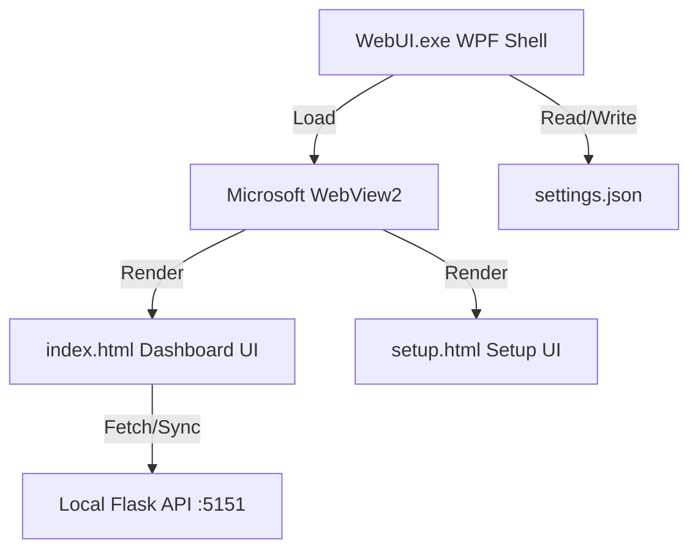

# WebUI Loader & Meeting Intent Detection Dashboard

> **Translate:** [日本語 (Japanese)](README.ja.md)

A custom borderless desktop widget browser loader and meeting intent detection dashboard built using WPF (Windows Presentation Foundation) and Microsoft WebView2.

> [!NOTE]
> This project operates as a horizontal, borderless (1420x240 px) window designed to be used as a desktop overlay or widget.

---

## 🚀 Key Features

### 1. WPF Host Application (`WebUI.exe`)
*   **Frameless & Borderless Design**: Clean horizontal layout (1420x240 px) without default title bars or borders.
*   **Custom Drag Handle**: A dark vertical drag bar on the far-left allows users to move the window freely around their desktop.
*   **Dynamic First-Run Configuration**: If no configuration is present on startup, the application loads an interactive setup screen (`setup.html`) to configure the target URL, saving it to `settings.json`.
*   **Reset Support**: If `settings.json` is deleted, the application automatically launches the setup screen again on the next run.
*   **Fullscreen Maximization (Double-Click)**: Double-clicking the window (or the custom drag bar) toggles the window state between maximized (borderless fullscreen) and normal size.
*   **Auto-Reset on Connection Failure**: If the application is closed while the target web page is inaccessible (e.g., the local server is offline), it automatically deletes `settings.json` so that the setup screen reappears on the next launch.
*   **Local File Fallback**: If the configured file is missing, it automatically falls back to loading the bundled `index.html`.
*   **Clean Shutdown**: Automatically detects and deletes the WebView2 temporary cache folder when closing, keeping the disk clean.

### 2. Meeting Intent Detection Dashboard (`index.html`)
*   **Real-time Intent Log**: Displays meeting events (Action Item, Concern/Q, Agreement, Topic Change, etc.) chronologically.
*   **Role Filtering**: Filter incoming meeting logs by choosing pre-configured roles (`Manager`, `Developer`, `Sales`) or entering a custom role.
*   **Doughnut Chart (Chart.js)**: Automatically compiles and updates the intent ratio in a clean, visual chart.
*   **AI Meeting Summary**: Displays meeting agenda, issues, and countermeasures in a retro cyberpunk-styled console modal.
*   **API Integration & Simulation**:
    *   Interfaces with a local API running at `http://127.0.0.1:5151` to sync session status, current roles, pull real-time logs, and fetch summary data.
    *   Includes mock simulation data for standalone runs when the local API is offline.

---

## 🛠️ Architecture & Dependencies



*   **Frontend**: HTML5, Vanilla JavaScript, Tailwind CSS (CDN), Chart.js (CDN)
*   **Backend (Shell)**: C# / WPF (.NET Framework 4.7.2)
*   **Browser Engine**: Microsoft.Web.WebView2 (NuGet package)
*   **Target API**: `http://127.0.0.1:5151` (Flask API streaming meeting events)

---

## 📦 Build & Packaging

A batch script is provided to automate compilation and package deployment in one click.

### Build Steps

1.  Double-click or run [build.bat](file:///d:/dev/InnoFes/WebUI-Loader/build.bat) from the root folder:
    ```cmd
    build.bat
    ```
2.  The script will:
    *   Locate `MSBuild.exe` using Visual Studio's `vswhere.exe`.
    *   Download `nuget.exe` to a temp directory and restore NuGet dependencies (WebView2).
    *   Rebuild the solution in `Release` configuration.
    *   Package all required assets into the [dist/](file:///d:/dev/InnoFes/WebUI-Loader/dist) directory.

### Distribution Package (`dist/` Folder)
The compiled [dist/](file:///d:/dev/InnoFes/WebUI-Loader/dist) directory contains only the files necessary for distribution:
*   `WebUI.exe` (Executable)
*   `WebUI.exe.config` (Standard config file)
*   `index.html` (Default web dashboard)
*   `setup.html` (Initial setup page)
*   `Microsoft.Web.WebView2.*.dll` (WebView2 assemblies)
*   `runtimes/` (Native loader architectures)

---

## ⚙️ Configuration

Initial settings are saved to `settings.json` in the same directory as the executable.

```json
{
  "DashboardUrl": "index.html"
}
```

> [!TIP]
> *   **Local Files:** Use relative paths (e.g., `index.html`) to load local web pages.
> *   **Remote Services:** Use full absolute URLs (e.g., `http://localhost:3000` or `https://google.com`) to load hosted web applications.
> *   **Resetting Settings:** To reconfigure the application, simply delete the `settings.json` file. The setup screen will automatically reappear on the next launch.

---

## 📡 API Endpoint Specifications

The endpoints communicating between the dashboard UI and the local backend API:

| Method | Endpoint | Description |
| :--- | :--- | :--- |
| `POST` | `/api/sessions` | Initiates a new meeting session and returns its ID |
| `GET` | `/api/settings/currentRole` | Fetches the currently selected user role |
| `PUT` | `/api/settings/currentRole` | Updates the active user role |
| `GET` | `/api/logPool/nextOldest` | Fetches the next meeting intent/log entry |
| `POST` | `/api/logPool` | Seeds mock logs if the pool is empty |
| `POST` | `/api/savedLogs/bulk` | Bulk saves meeting logs |
| `GET` | `/api/summaries/projectReview` | Fetches the AI-generated meeting summary |
| `PUT` | `/api/summaries/projectReview` | Overwrites or updates the meeting summary data |
